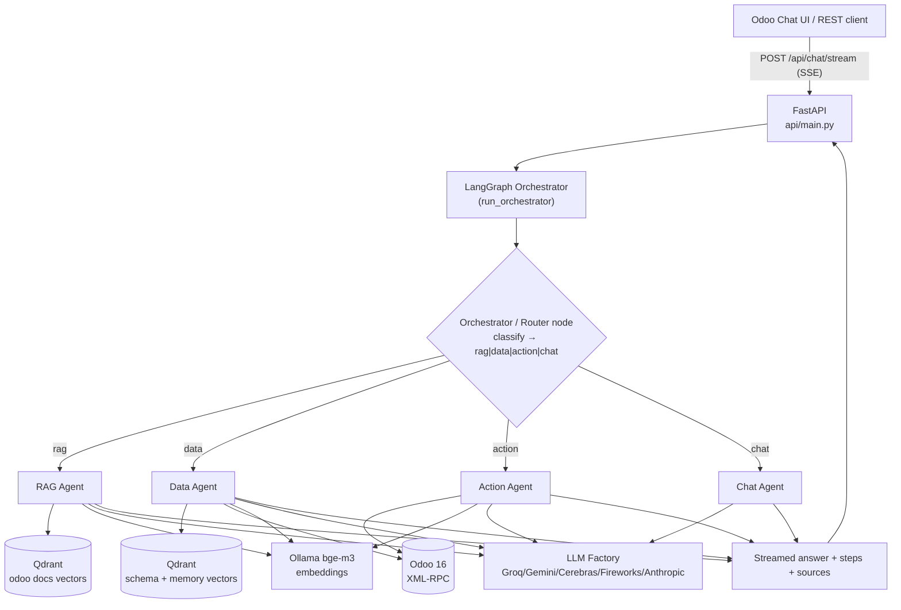

# 02 — System Architecture

## 2.1 High-level view

The platform is a **multi-agent system** built on **LangGraph**, exposed through a **FastAPI** streaming API, that reads/writes a live **Odoo 16** instance via **XML-RPC** and answers documentation questions from a **Qdrant** vector index of the official docs. The LLM layer is **provider-agnostic** (Groq / Gemini / Cerebras / Fireworks / Anthropic).

## 2.2 The request lifecycle (step by step)

1. **HTTP request.** The client calls `POST /api/chat/stream` with `{question, session_id, llm_provider, odoo_user_email, odoo_api_key}` ([api/main.py](../api/main.py)).
2. **Streaming bridge.** FastAPI spawns a worker thread that runs the orchestrator, while the main coroutine drains a `queue.Queue` and emits **Server-Sent Events** (`text/event-stream`). Two kinds of events are pushed:
   - `step` events — live progress ("Searching models…"), via an `on_step(step_num, message)` callback threaded down into every agent.
   - a final event — the answer plus metadata (`route`, `steps`, `sources`, `needs_confirmation`, `confirmation_summary`, `pending_action`).
3. **Orchestration.** `run_orchestrator(...)` builds the initial `OrchestratorState` and streams the compiled LangGraph graph.
4. **Routing.** The `orchestrator` node asks an LLM to classify the question into exactly one of `rag | data | action | chat`. A conditional edge sends the state to the chosen agent node. (Falls back to `chat` on any error.)
5. **Specialized agent.** The selected agent does its work (see docs 04–07), writing its result back into the shared state.
6. **Termination.** Every agent node leads to `END`; the final state is returned and the answer is streamed back to the client.
7. **(Action only) Confirmation round-trip.** If the action agent decided a write is needed, it returns `needs_confirmation = True` and a `pending_action`. The UI shows a Confirm/Cancel prompt; on confirm the client calls `POST /api/confirm-action`, which executes the previously-staged tool. This is a **second HTTP call**, not a graph continuation.

## 2.3 Component map (where things live)

| Layer | Module(s) | Responsibility |
|-------|-----------|----------------|
| **API** | [api/main.py](../api/main.py) | HTTP endpoints, SSE streaming, action confirmation |
| **Orchestration** | [Graph/builder.py](../Graph/builder.py), [Graph/routers.py](../Graph/routers.py), [Graph/state.py](../Graph/state.py), [agents/orchestrator_agent/](../agents/orchestrator_agent/) | Build/compile the graph, the shared `State`, routing |
| **Agents** | [agents/rag_agent/](../agents/rag_agent/), [agents/data_agent/](../agents/data_agent/), [agents/action_agent/](../agents/action_agent/), [agents/chat_agent/](../agents/chat_agent/) | The four specialists |
| **LLM abstraction** | [shared/llm_factory.py](../shared/llm_factory.py) | One factory → many providers |
| **Embeddings** | [shared/embedding.py](../shared/embedding.py) | Singleton Ollama bge-m3 model |
| **Vector store** | [db/vector_store.py](../db/vector_store.py) | Qdrant collections (docs / schema / memory) |
| **Relational / introspection** | [db/sql_connector.py](../db/sql_connector.py), [db/schema_cache.py](../db/schema_cache.py) | PostgreSQL connection & schema cache (used by ETL/schema tooling) |
| **Odoo access** | [core/odoo_client.py](../core/odoo_client.py) | XML-RPC client (auth, search_read, read_group, create, write, …) |
| **ETL** | [etl/](../etl/) + [scripts/](../scripts/) | Scrape docs → chunk → embed → index; extract & index schema |
| **Tools** | [tools/](../tools/) | LLM client wrappers, retriever, chart generator, schema selector |
| **Resilience** | [utils/retry.py](../utils/retry.py) | Exponential-backoff retry decorator |
| **Persistence** | [db/conversation_store.py](../db/conversation_store.py) | Per-session JSON history |
| **Config** | [config/settings.py](../config/settings.py) | Pydantic settings from `.env` |

## 2.4 Two data planes

The system deliberately separates two very different data needs:

- **Knowledge plane (read-only, static):** the Odoo *documentation*, scraped from GitHub, chunked, embedded and stored in Qdrant. Used by the RAG agent. Refreshed by an offline ETL job.
- **Operational plane (live, read/write):** the company's *actual ERP data*, reached at runtime through **Odoo XML-RPC**. Used by the data and action agents. Never cached — always current.

A third **meta plane** supports the operational plane: a vector index of the Odoo **schema** (models + fields) and a vector store of **agent memories** (past successful query patterns), both in Qdrant.

## 2.5 Why XML-RPC instead of direct SQL for live data

The earlier design (see root README) generated raw SQL against the Odoo PostgreSQL database. The current design talks to Odoo's **XML-RPC ORM API** instead. This matters and is a likely defense question — see [11-technology-rationale.md](11-technology-rationale.md) and [12-soutenance-qa.md](12-soutenance-qa.md). In short: XML-RPC respects Odoo **access rights / record rules**, computed fields, and business logic, and authenticates **per-user**, whereas raw SQL bypasses all of that.

## 2.6 Cross-cutting concerns

- **Streaming-first.** Everything is built to emit progress events so the UI feels responsive on multi-second agent runs.
- **Provider-agnostic LLMs.** No agent imports a vendor SDK directly; all go through `get_llm(LLMProvider.X)`.
- **Fail-safe defaults.** Router falls back to `chat`; rewriter falls back to the original query; evaluator fails *open* (accepts) so the user is never blocked; SQL/Odoo errors are caught and surfaced, not crashed on.
- **Resilience.** External API calls are wrapped in `@with_retry` (3 attempts, exponential backoff).
- **Security.** Odoo credentials (`odoo_user_email`, `odoo_api_key`) are passed per-request and flow through the state into the tools; write actions are gated.
