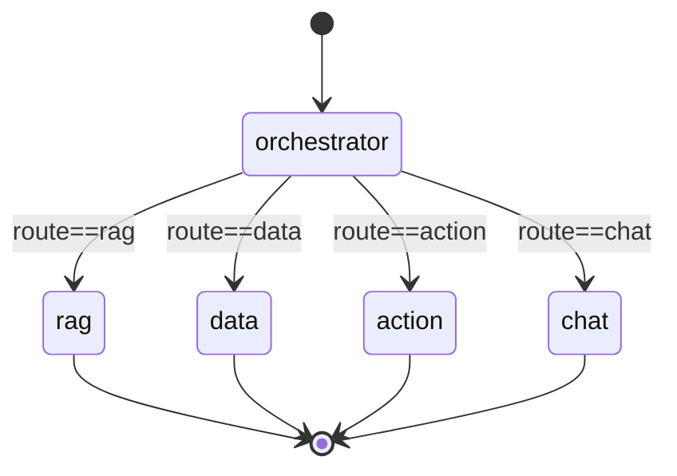

# 03 — Orchestrator & LangGraph

This is the "brain stem" of the system: the shared state, the graph topology, and the routing decision.

## 3.1 What LangGraph is (concept)

**LangGraph** (from the LangChain ecosystem) models an application as a **directed graph of nodes** operating over a **shared, typed state**. Each node is a function `state -> partial_state_update`. Edges decide what runs next; **conditional edges** branch based on the state. Compared to a plain chain, a graph gives you:

- explicit **control flow** (branching, loops, retries) that you can reason about and visualize;
- a single **state object** that every node reads from and writes to;
- built-in **streaming** (emit per-node updates), **checkpointing** (persist state per `thread_id`), and human-in-the-loop pauses.

We use it as an **orchestration layer**: one router node + four leaf agent nodes.

## 3.2 The shared State

Defined in [Graph/state.py](../Graph/state.py) as a `TypedDict`:

```python
class OrchestratorState(TypedDict):
    question: str                          # user input
    session_id: str                        # session/thread id
    route: Optional[str]                   # "rag" | "data" | "action" | "chat"
    messages: Annotated[list[BaseMessage], add_messages]  # conversation, merged
    answer: str                            # final answer text
    llm_provider: Any | None               # which LLM to use downstream
    sources: list[str]                     # RAG: cited sources
    steps: list[str]                       # human-readable execution trace
    needs_confirmation: bool               # action: write needs user OK
    confirmation_summary: str              # action: what will happen
    metadata: dict[str, Any]               # which agent handled it, attempts, etc.
    on_step: Optional[Callable]            # progress callback (SSE)
    pending_action: dict | None            # action: staged tool + args
    odoo_user_email: str | None            # per-user Odoo credential
    odoo_api_key: str | None               # per-user Odoo credential
```

**Key idea — the `add_messages` reducer.** The `messages` field is annotated with `add_messages`, LangGraph's *reducer* that **merges** new messages into the list instead of overwriting it. All other fields use the default "last write wins" semantics. This is what lets the conversation accumulate while scalar fields like `answer` are simply replaced.

## 3.3 The graph topology

Built and compiled once in [Graph/builder.py](../Graph/builder.py):

```python
builder = StateGraph(OrchestratorState)

builder.add_node("orchestrator", orchestrator_node)
builder.add_node("rag",    run_rag_agent)
builder.add_node("data",   run_data_agent)
builder.add_node("action", action_agent_node)
builder.add_node("chat",   chat_node)

builder.add_edge(START, "orchestrator")

builder.add_conditional_edges(
    "orchestrator",
    route_selector,                 # reads state["route"]
    {"rag": "rag", "data": "data", "action": "action", "chat": "chat"},
)

for node in ("rag", "data", "action", "chat"):
    builder.add_edge(node, END)

orchestrator_graph = builder.compile()   # compiled once at import
```



It is intentionally a **shallow star**: one decision, one specialist, done. There is no inter-agent chaining at the graph level (each specialist runs its *own* internal loop). This keeps the orchestration easy to reason about and debug.

## 3.4 The routing decision

[agents/orchestrator_agent/node.py](../agents/orchestrator_agent/node.py) classifies the question with an LLM:

```python
_llm = get_llm(LLMProvider.GROQ_LLAMA33)          # fast model for a cheap decision
_VALID_ROUTES = {"rag", "data", "action", "chat"}
_FALLBACK = "chat"

def _classify(question: str) -> str:
    try:
        resp = _llm.invoke([
            {"role": "system", "content": ROUTER_SYSTEM_PROMPT},
            {"role": "user",   "content": ROUTER_USER_TEMPLATE.format(question=question)},
        ])
        raw = resp.content.strip().lower()
        return raw if raw in _VALID_ROUTES else _FALLBACK
    except Exception:
        return _FALLBACK
```

The **router system prompt** ([prompts.py](../agents/orchestrator_agent/prompts.py)) defines the four categories with examples and forces the model to answer with **exactly one word**:

- `rag` — documentation / how-to / configuration / features.
- `data` — questions about the company's real data.
- `action` — concrete Odoo operations (create / confirm / modify / send).
- `chat` — greetings, identity, off-topic, everything else.

`route_selector` in [Graph/routers.py](../Graph/routers.py) is a trivial pass-through: `return state.get("route", "chat")`. The intelligence is in the node; the router function just reads the decision.

### Design notes / defensible choices

- **LLM classification over keyword rules.** A small fast model generalizes to paraphrases and two languages far better than a keyword list. A keyword router was the original design (see root README "keywords-first"); the LLM router is more robust.
- **Fail-safe to `chat`.** Any unexpected output or API error degrades gracefully to the harmless conversational agent rather than crashing or picking a destructive route.
- **Constrained output.** Restricting the model to one of four tokens makes parsing trivial and the decision auditable.

## 3.5 The entry function

`run_orchestrator(question, session_id, on_step, llm_provider, odoo_user_email, odoo_api_key, history=…)` (exported from [agents/orchestrator_agent/](../agents/orchestrator_agent/)):

1. Constructs the initial `OrchestratorState`.
2. Streams the compiled graph with `config={"configurable": {"thread_id": session_id}}` (so checkpointing is scoped per session).
3. For every per-node chunk, increments a step counter and calls `on_step(step_num, label)` (where `_NODE_LABELS` maps node names to human-friendly French labels).
4. Returns a flat dict: `route, answer, sources, steps, needs_confirmation, confirmation_summary, pending_action, metadata`.

## 3.6 Why this architecture (vs. one big prompt / one ReAct agent)

- **Separation of concerns.** Each agent has a focused prompt and a focused tool set; the data agent's 9 Odoo tools never confuse the RAG agent, and vice-versa.
- **Right model for the job.** Routing uses a cheap fast model; planning uses a reasoning model; formatting uses a light model (see [09-llm-strategy.md](09-llm-strategy.md)).
- **Reliability.** A single mega-agent with all tools tends to misfire (wrong tool, wrong domain). A narrow specialist with a curated prompt is far more accurate.
- **Maintainability & observability.** You can test, swap, and trace each agent independently; the `steps` trace makes runs explainable to the end user and the developer.
