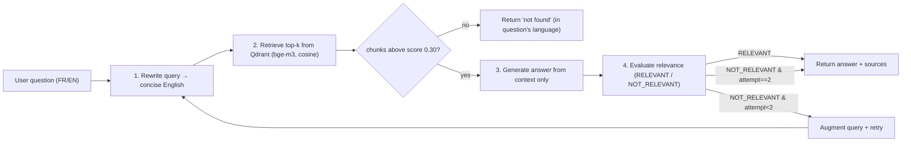

# 04 — RAG Agent (Documentation Q&A)

The RAG agent answers **how-to / configuration / feature** questions about Odoo 16, grounded strictly in the **official documentation**. It implements a **self-corrective (CRAG-style) loop**: it grades its own answer and retries with a reformulated query if the answer is judged inadequate.

Code: [agents/rag_agent/agent.py](../agents/rag_agent/agent.py), [rewriter.py](../agents/rag_agent/rewriter.py), [retriever.py](../agents/rag_agent/retriever.py), [evaluator.py](../agents/rag_agent/evaluator.py).

## 4.1 What RAG is (concept)

**Retrieval-Augmented Generation** combats LLM hallucination by *grounding* answers in retrieved documents. Pipeline: embed the query → search a vector store for the most semantically similar chunks → put those chunks in the prompt as context → the LLM answers **only from that context**. The answer is therefore traceable to sources and current with whatever was indexed.

**Corrective RAG (CRAG) / Self-RAG** adds a feedback loop: after generating, an evaluator judges whether the answer actually addresses the question. If not, the system *acts* — here, by reformulating the query and retrying. This catches the common failure where the first retrieval misses the right passages.

## 4.2 Pipeline overview



`run_rag_agent(state)` runs up to `_MAX_ATTEMPTS = 2` iterations.

## 4.3 Stage 1 — Query rewriting

[rewriter.py](../agents/rag_agent/rewriter.py): `rewrite_query(question, llm)` transforms the raw user question (any language, conversational) into a **concise English technical query (≤10 words)** with relevant Odoo terms and noise removed.

- *"comment je configure les factures automatiques"* → *"configure automatic invoice generation Odoo 16"*

**Why:** the documentation is indexed in English; embeddings match better on a clean, keyword-dense query than on a chatty multilingual sentence. **Fail-safe:** if the LLM errors, it returns the original question unchanged.

## 4.4 Stage 2 — Retrieval

[retriever.py](../agents/rag_agent/retriever.py): `retrieve(query, top_k=8)`:

1. Embed the (rewritten) query with **bge-m3** via Ollama → 768-dim vector.
2. `VectorStoreManager.search(vector, top_k=8)` against Qdrant (**cosine** similarity).
3. **Filter** out chunks below `MIN_SCORE = 0.30` (drops weak/irrelevant matches).
4. Return `[{content, metadata, score}]`.

Helpers:
- `format_context(chunks)` → readable, numbered context blocks (`[Extrait 1 — source (score: 0.92)] …`) fed to the LLM.
- `extract_sources(chunks)` → deduplicated source list (best score per source) returned to the UI for citation.

## 4.5 Stage 3 — Answer generation

`_generate_answer(question, context, llm)` uses a system prompt that enforces three rules:

1. Answer **only** from the provided context (no invention).
2. Answer **in the same language** as the question (FR→FR, EN→EN).
3. If the context is insufficient, say so explicitly with a fixed sentence ("Je n'ai pas trouvé cette information…" / "I could not find this information…").

This is the anti-hallucination guardrail: the model is told the context is the single source of truth.

## 4.6 Stage 4 — Self-evaluation (the corrective part)

[evaluator.py](../agents/rag_agent/evaluator.py): `evaluate_relevance(question, answer, llm)` returns `"RELEVANT"` or `"NOT_RELEVANT"`. The evaluator is a separate LLM call acting as a **judge**: is the answer complete and on-topic, or is it off-topic / a "not found"?

- If `RELEVANT` → accept and return.
- If `NOT_RELEVANT` and attempts remain → **augment** the query (`"{question} detailed steps configuration Odoo 16"`) and loop again from rewrite.
- **Fail-open:** if the evaluator errors, it returns `RELEVANT` so the user is never blocked by an evaluator outage.

## 4.7 Language handling

A lightweight heuristic (`_detect_not_found_message`) checks for French stopwords (`comment`, `quel`, `est`, …) to pick the language of the fixed "not found" message when retrieval returns nothing. (The main answer's language is enforced by the generation prompt itself.)

## 4.8 Output contract

```python
{
  "answer":  str,
  "sources": [{"source", "url", "score"}, ...],
  "steps":   ["Réécriture de la requête", "Recherche…", "Génération…", "Évaluation…", ...],
  "metadata": {"handled_by": "rag_agent", "attempts": 1|2, "rewritten_query": "..."}
}
```

Each stage emits an `on_step` progress event so the UI shows the live pipeline.

## 4.9 Default LLM

`_DEFAULT_PROVIDER = LLMProvider.GROQ_QWEN3`. Groq gives very low latency; Qwen3-32B is a capable instruction model well-suited to grounded summarization and the binary relevance judgment. Provider is overridable per request.

## 4.10 Design rationale (defense-ready)

- **Why rewrite before retrieving?** Aligns the query with the indexed language/vocabulary → better recall.
- **Why a score threshold (0.30)?** Prevents "garbage context" — if nothing is genuinely similar, it's better to say "not found" than to summarize irrelevant text.
- **Why a self-evaluation loop?** The single biggest RAG failure is *retrieval miss*. Grading + one reformulated retry recovers many of these at low extra cost, without a heavyweight agentic framework.
- **Why cap at 2 attempts?** Diminishing returns vs. latency/cost; one reformulation captures most of the benefit.
- **Why fail-open on the evaluator but fail-safe on the rewriter?** Different risk profiles: a broken evaluator should not block a possibly-good answer; a broken rewriter should not lose the user's intent.

## 4.11 Note on `tools/retriever.py` and `tools/reranker.py`

[tools/retriever.py](../tools/retriever.py) is an **older `RAGRetriever` wrapper** superseded by `agents/rag_agent/retriever.py`. [tools/reranker.py](../tools/reranker.py) is effectively **empty** — a cross-encoder reranking stage was scaffolded but not implemented. (Honest scoping note for the defense: reranking is a natural next improvement; today relevance is filtered by the cosine threshold and corrected by the self-evaluation loop.)
