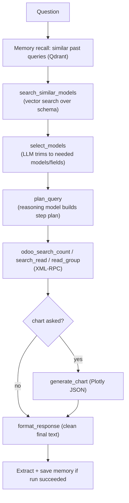

# 05 — Data Agent (Natural Language → Live Data)

The data agent answers questions about the company's **real data** ("how many active customers?", "revenue per month", "top 10 products") by translating natural language into **safe Odoo XML-RPC queries**. It is the most sophisticated agent: it combines **semantic schema discovery**, **LLM query planning**, **a learned memory**, and **chart generation**, orchestrated as a **ReAct tool-using agent**.

Code: [agents/data_agent/agent.py](../agents/data_agent/agent.py), [tools.py](../agents/data_agent/tools.py), [memory_store.py](../agents/data_agent/memory_store.py), [memory_extractor.py](../agents/data_agent/memory_extractor.py).

## 5.1 The core challenge

Odoo has **hundreds of models and thousands of fields**. You cannot put the whole schema in a prompt. And the *right* fields are not obvious from names alone (e.g. the "salesperson" of an order is `user_id`, not a field literally called "salesperson"; "customers" are `res.partner` rows with `customer_rank > 0`). So the agent must **discover the relevant slice of the schema** before it can write a query — and it must respect Odoo's real-world quirks.

## 5.2 Agent shape: ReAct with `create_react_agent`

`run_data_agent(state)` builds a **ReAct agent** (`langgraph.prebuilt.create_react_agent`) over a fixed tool set, and streams its reasoning. ReAct = the LLM alternates **Reason** (decide next tool) and **Act** (call tool, observe result) until it produces a final answer. Short-term memory across turns is provided by a `MemorySaver` checkpointer keyed on `thread_id` (the session id).

The tool set (8–9 tools):

```python
TOOLS = [
    search_similar_models,   # semantic schema search (level 1)
    select_models,           # LLM schema refinement (level 2)
    plan_query,              # generate an execution plan
    odoo_search_count,       # COUNT with a domain
    odoo_search_read,        # SELECT … WHERE
    odoo_read_group,         # GROUP BY + aggregates
    generate_chart,          # Plotly chart
    format_response,         # final user-facing formatting
]
```



## 5.3 Step 0 — Memory recall

Before reasoning, `MemoryStore.search(question, top_k=3)` retrieves up to 3 **similar past successful queries** from a Qdrant collection (`agent_memories`), filtered by similarity ≥ 0.70 and de-duplicated. They are formatted into the system prompt as worked examples ("for this kind of question, this model + this domain + these tools worked"). This is **in-context learning from the agent's own history** (see §5.8).

## 5.4 Two-level schema discovery (the key innovation)

### Level 1 — `search_similar_models` (vector search over the schema)

The Odoo schema itself was indexed into Qdrant (see [08-etl-and-indexing.md](08-etl-and-indexing.md)): two collections, `odoo_models_v3` (one vector per model) and `odoo_fields_v3` (one vector per field). At query time:

1. Embed the question with bge-m3.
2. **Stage A — models:** search `odoo_models_v3`, take top candidates, multiply each hit's score by a per-model **`weight`** stored in the payload (business-critical models like `res.partner`, `sale.order`, `account.move` are weighted up). Keep the top `top_k_models` (default 4).
3. **Stage B — fields:** for each kept model, search `odoo_fields_v3` filtered to that model (up to 150 candidates), then apply a **`MASTER_BOOST`** dictionary — ~75 French business keywords → field names — that adds `+2.0` to a field's score when the question contains the keyword (e.g. *"vendeur"* boosts `user_id`; *"montant"* boosts `amount_total`/`amount_untaxed`). Keep the top `top_k_fields` (default 15) per model.
4. Return `{"model": ["field1", "field2", …]}` as JSON.

> **Why hybrid (vectors + keyword boosts)?** Pure vector search sometimes ranks a plausible-but-wrong field above the correct one. The boost dictionary injects **domain knowledge** to pin the fields that *actually* answer common business questions — a pragmatic hybrid of semantic + lexical retrieval.

### Level 2 — `select_models` (LLM refinement + relation expansion)

The Level-1 candidates are still broad. `select_models(question, candidates)` asks a **light, fast LLM** (`GEMINI_FLASH_LITE`) to keep **only** the models/fields strictly needed, returning a tight JSON sub-schema. Then `expand_schema_with_relations(...)` automatically pulls in **one-hop related models** for relational fields (e.g. selecting `seller_ids` also brings in `product.supplierinfo`), and strips internal metadata keys.

> **Why two levels?** Level 1 (vectors) gives **recall** — don't miss a relevant field. Level 2 (LLM) gives **precision** — don't drown the query planner in noise. Together they hand the planner a minimal, correct schema slice. (This "search with two levels for model similarity" is an explicit milestone in the git history.)

## 5.5 `plan_query` — turning the slice into a plan

`plan_query(question, subschema)` uses a **reasoning-focused model** (`FIREWORKS_DEEPSEEK`, temperature 0; falls back to Kimi on rate-limit) to emit a **JSON execution plan**: an ordered list of steps, each naming a tool, model, domain hint, fields hint, groupby hint, and how the result feeds the next step (including pure-Python join/aggregation steps).

Crucially, the planner prompt encodes Odoo XML-RPC's **dot-notation rules**:

| Parameter | Dot notation (`a.b`) | Why |
|-----------|----------------------|-----|
| `domain`  | **allowed** | the ORM resolves `order_id.state` in filters |
| `fields`  | **forbidden** | `read`/`search_read` cannot select traversed fields → ValueError |
| `groupby` | **forbidden** | not supported → error / wrong result |

So when a question spans related models, the plan reads each model separately and **joins in Python**. Encoding these constraints upfront is what prevents the most common class of generated-query failures.

## 5.6 Execution tools (Odoo XML-RPC)

All three call [core/odoo_client.py](../core/odoo_client.py) via `get_odoo_client(username=odoo_user_email, api_key=odoo_api_key)` and parse the LLM-provided domain string safely (`ast.literal_eval` with a JSON fallback, normalizing `true/false/null`).

- **`odoo_search_count(model, domain)`** → `count`. The prompt enforces Odoo semantics like *clients* = `customer_rank > 0`, *suppliers* = `supplier_rank > 0`.
- **`odoo_search_read(model, domain, fields, limit=80, order="")`** → JSON records. `order` must use only direct fields of the target model; many2one fields come back as `[id, "Name"]`.
- **`odoo_read_group(model, domain, fields, groupby, …)`** → grouped aggregates. Field syntax `'amount_untaxed:sum'`, `'id:count'`; groupby like `'partner_id'` or `'date_order:month'`.

### The date-granularity workaround (a notable detail)

Odoo 16's XML-RPC `read_group` does **not** accept `:month` / `:year` granularity the way the UI does. The tool therefore:

1. **Strips** the granularity (`date_order:month` → `date_order`) before the RPC call (`_strip_date_granularity`).
2. Executes the group.
3. **Re-groups in Python** by truncating the date (`2026-01-15` → `2026-01` for month, `2026` for year) and summing numeric columns (`_apply_date_granularity`).
4. Renames the key back to `date_order:month` for the consumer.

It also cleans `__`-prefixed internal keys and flattens many2one `[id, "Name"]` tuples to the readable name. Safety rule baked into the prompt: `orderby` must reference an aggregate (never bare `id`, which causes `AmbiguousColumn`).

## 5.7 Chart generation

`generate_chart(data, chart_type, title, x_field, y_field)` ([tools/chart_generator.py](../tools/chart_generator.py) / data_agent tools):

- Loads the rows into a pandas DataFrame; **falls back** to the first/second columns if the named `x_field`/`y_field` are absent; coerces `y` to numeric.
- Builds a **Plotly** figure (`bar` / `line` / `pie`) and serializes it to JSON.
- Stores the JSON in a module-level `_last_chart_store` and returns only a short confirmation string to the LLM (so the large chart JSON doesn't pollute the context window). The API retrieves the chart separately via `get_last_chart()`.

## 5.8 Agent memory (learning from experience)

A distinctive feature: the agent **remembers what worked** and reuses it.

**Data model** (`AgentMemory` dataclass): `question_summary`, `question_type` (count/list/aggregate/chart/other), `odoo_model`, `domain_used`, `tools_sequence`, `final_answer_pattern`, `error_avoided`.

**Write path** ([memory_extractor.py](../agents/data_agent/memory_extractor.py)): after a *successful* run (checked against error keywords via `_is_failed_execution`), an LLM (Groq) reads the execution trace and extracts an `AgentMemory` JSON.

**Store** ([memory_store.py](../agents/data_agent/memory_store.py)): Qdrant collection `agent_memories`, 768-dim cosine. On `save`, it embeds `"{summary} model:{model}"` and **de-duplicates**: if an existing memory scores ≥ `DEDUP_THRESHOLD = 0.95`, the new one is skipped. On `search`, it returns the top-k above `SEARCH_THRESHOLD = 0.70`, de-duplicated by `(summary, model)`.

> **Why this matters:** it's a feedback loop that makes the agent **more reliable over time** on recurring questions, and it lets the system encode "errors to avoid" learned from past runs — without retraining any model. It's retrieval-augmented *procedure* memory, complementing the document RAG.

## 5.9 System prompt rules (correctness guardrails)

The data-agent system prompt injects, among others:
- Odoo-16 migration facts (`customer_rank > 0`, not a non-existent `is_customer`).
- Domain must be a **Python-string** literal (`"[['state','=','done']]"`).
- The **mandatory tool order** for non-trivial questions: `search_similar_models` → `select_models` → `plan_query` → execution → **`format_response`**.
- The per-user Odoo credentials to pass into every Odoo tool.

`format_response(raw_answer, question)` makes the final pass with a light LLM (`GEMINI_FLASH_LITE`): adds tasteful emojis, structures multi-part answers, stays in the question's language, and **adds no new facts**.

## 5.10 Output contract

```python
{ "answer": str, "steps": [ ... human-readable trace ... ],
  "metadata": {"handled_by": "data_agent"} }
```

Every tool call and result is summarized into a `steps` entry (via `_format_tool_args` / `_format_tool_result`) and streamed live.

## 5.11 Defense-ready rationale

- **Why not just generate one SQL string?** Odoo's data is governed by ORM logic, computed fields, translations (JSONB names), and access rules. Going through XML-RPC respects all of that and runs under the user's permissions (see [06](06-action-agent.md) and [11](11-technology-rationale.md)).
- **Why semantic schema search instead of dumping the schema?** Context-window limits + precision: the planner does far better with a 2–4 model slice than with the entire ERP schema.
- **Why a separate planner model?** Decomposing multi-model questions and respecting RPC constraints is a *reasoning* task; a reasoning model at temperature 0 produces stable, machine-readable plans.
- **Why memory?** Cheap, training-free reliability gains on the long tail of recurring business questions.
