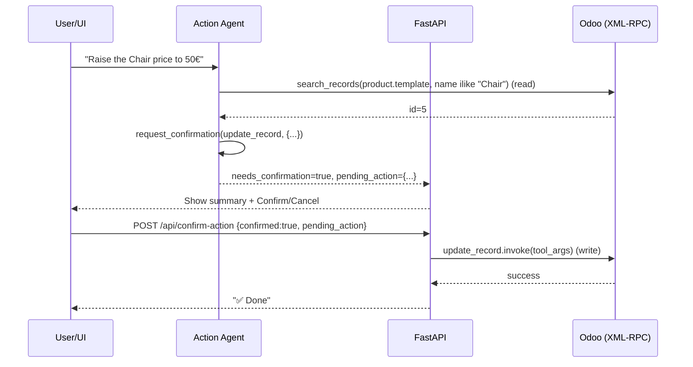

# 06 — Action Agent (ERP Write Operations)

The action agent performs operations that **change** the ERP: create, update, delete records, run workflow methods (confirm an order, post an invoice), and send emails. Because these are irreversible/consequential, every write is gated behind **human-in-the-loop confirmation** and runs under the **individual user's** Odoo credentials.

Code: [agents/action_agent/node.py](../agents/action_agent/node.py), [tools.py](../agents/action_agent/tools.py), [prompts.py](../agents/action_agent/prompts.py); Odoo access via [core/odoo_client.py](../core/odoo_client.py).

## 6.1 Agent shape

A **ReAct** agent (Thought → Action → Observation) on `GROQ_LLAMA33` by default. The system prompt enforces a disciplined protocol before any tool call:

1. **Analyze** — what exactly is requested?
2. **Identify** — which Odoo model(s)? Do I know their technical names?
3. **Verify** — do I have the record **IDs**? If the user said a name ("Ahmed", "the Chair"), I do **not** have the ID and must `search_records` first.
4. **Strategy** — which is the safest tool for this step?

It also teaches **document-prefix → model** deduction (`S00027`→`sale.order`, `INV/…`→`account.move`, `WH/OUT/…`→`stock.picking`, …) and **line-item rules** (to add a line you create in `sale.order.line` with `order_id` + `product_id`, never by editing the parent document blindly).

## 6.2 The tool set

| Tool | Writes? | Confirm? | Odoo call |
|------|:------:|:-------:|-----------|
| `discover_model(intent)` | no | no | search `ir.model` by name → technical model name |
| `get_model_fields(model)` | no | no | `fields_get` → valid fields/types for the model |
| `search_records(model, filters, fields, limit)` | no | no | `search_read` (read-only lookup) |
| `create_record(model, values)` | **yes** | **yes** | `create` |
| `update_record(model, record_id, values)` | **yes** | **yes** | `write` |
| `delete_record(model, record_id)` | **yes** | **yes** | `unlink` (irreversible) |
| `execute_action(model, method, record_id)` | **yes** | **yes** | call a workflow method (e.g. `action_confirm`, `action_post`) |
| `send_email(partner_id, subject, body)` | **yes** | **yes** | create + send `mail.mail` |
| `request_confirmation(...)` | no (signal) | — | none — returns a `WAITING_CONFIRMATION` payload |

The three read tools (`discover_model`, `get_model_fields`, `search_records`) let the agent **ground itself**: find the model, learn its real fields, and look up the IDs it needs — so it never guesses IDs or field names. If Odoo returns "field x does not exist", the prompt tells it to call `get_model_fields`, fix the call, and retry.

## 6.3 Human-in-the-loop confirmation (the safety core)

Every write tool is forbidden from executing directly. Instead the agent must first call **`request_confirmation(action_type, action_summary, tool_name, tool_args)`**, which does **not** touch Odoo — it returns a structured payload and the agent then **stops**:

```json
{
  "status": "WAITING_CONFIRMATION",
  "action_type": "update",
  "summary": "Update Chair price to 50€",
  "pending_action": {
    "tool_name": "update_record",
    "tool_args": {"model": "product.template", "record_id": 5, "values": "{\"list_price\": 50}", ...}
  },
  "message": "⚠️ Confirmation required …\nClick **Confirm**."
}
```

Flow:



On the graph side, `action_agent_node` scans the messages (`_extract_confirmation`) for the `WAITING_CONFIRMATION` status and lifts `needs_confirmation`, `confirmation_summary`, and `pending_action` into the orchestrator state. Execution of the staged write happens in a **separate HTTP call** — `POST /api/confirm-action` ([api/main.py](../api/main.py)) — which looks `tool_name` up in an allow-list (`create_record`, `update_record`, `delete_record`, `execute_action`, `send_email`) and invokes it with the stored args. Unknown tool names are rejected.

> **Why a second HTTP call rather than pausing the graph?** It cleanly decouples "decide + stage the action" from "execute after the human says yes", keeps the backend stateless between the two, and makes the confirmation explicit and auditable. The allow-list on `/api/confirm-action` ensures only the five intended write tools can ever be triggered this way.

## 6.4 Authentication & authorization

- Credentials (`odoo_user_email`, `odoo_api_key`) arrive on every request and flow through the state. The prompt **requires** the agent to pass them into every Odoo tool call; each tool builds a fresh `OdooClient(username, api_key)`.
- [core/odoo_client.py](../core/odoo_client.py) authenticates via **API key** (not password) against `/xmlrpc/2/common`, caches the resulting `uid`, and routes all calls through `execute_kw` on `/xmlrpc/2/object`. Auth and every call are wrapped in `@with_retry` (3 attempts, exponential backoff).
- **Authorization is delegated to Odoo.** Because calls run as the authenticated user, Odoo's server-side **access rights and record rules** apply — the agent cannot do anything the user couldn't do in the UI. There is no privileged bypass.
- `_clean_domain` replaces `None` with `False` (XML-RPC has no null) while preserving logical operators `|`, `&`, `!`; `fields_get` filters out binary/html/serialized and `message_*`/`activity_*`/`website_*` noise fields.

## 6.5 Legacy file note

[tools/odoo_xmlrpc.py](../tools/odoo_xmlrpc.py) is an **older, hard-coded** `OdooXMLRPC` class (password auth, fixed methods like `create_sale_order`, `create_invoice`, `update_product_price`). It is **not used by the agents** — superseded by the generic, credential-scoped tools in `agents/action_agent/tools.py`. Mention it only as evolution history.

## 6.6 Defense-ready rationale

- **Why human-in-the-loop?** LLMs are probabilistic; an autonomous write could delete or post the wrong record. A confirmation gate makes the human the final authority for any state change — the single most important safety property of the system.
- **Why generic tools (create/update/delete/execute) instead of one tool per business operation?** Generality: any model and any workflow method become reachable without new code; the agent composes them using `discover_model` + `get_model_fields`.
- **Why per-user API-key auth?** Accountability and least privilege — operations are attributable to a real user and bounded by their permissions.
- **Why force search-before-act?** Eliminates ID hallucination, the most dangerous failure mode for writes.
