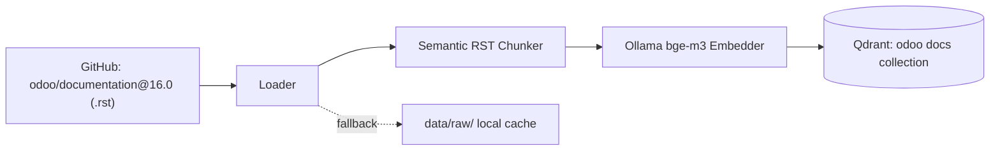

# 08 — ETL & Indexing (Offline Pipelines)

Two offline pipelines feed the runtime: (1) the **documentation ETL** that powers the RAG agent, and (2) the **schema indexing** that powers the data agent's semantic schema search. Both write vectors into Qdrant.

## 8.1 Documentation ETL — Load → Chunk → Embed → Store

Orchestrated by [etl/pipeline.py](../etl/pipeline.py) (`ETLPipeline.run()`), launched via [scripts/run_etl.py](../scripts/run_etl.py).

### Load — [etl/loader.py](../etl/loader.py)

- Scrapes `.rst` files from the official `odoo/documentation` repo, branch **16.0**, under `content/`, using a GitHub token.
- **Graceful degradation:** caches files in `data/raw/` and falls back to cache-only mode if GitHub is unavailable or the token is invalid; sleeps 60 s and retries on API rate limits.
- Excludes non-product dirs (`legal/`, `releases/`, `contributing/`, …) and files like `CHANGELOG`.
- Each doc carries metadata: `source`, `filename`, `branch`, `url`, `content`.

### Chunk — [etl/chunker.py](../etl/chunker.py) (`SemanticRSTChunker`)

A **two-stage** strategy:
1. **Structural split** on RST section headers (`===`, `---`, `~~~`, …) — respects the document's natural hierarchy and keeps a section title as context.
2. **Semantic split** within each section using LangChain's `SemanticChunker` (`breakpoint_threshold_type="percentile"`, threshold 90) — cuts where the cosine distance between consecutive sentences spikes, so each chunk is topically coherent. Chunks under `_MIN_WORDS = 30` are dropped as noise; toctree-heavy index files are detected and skipped.

> **Why semantic chunking, not fixed-size?** Fixed character windows cut mid-idea and split related sentences across chunks, hurting retrieval. Splitting on **meaning boundaries** keeps each chunk self-contained → higher retrieval precision.

### Embed — [etl/embedder.py](../etl/embedder.py)

Uses the **shared singleton** embedder ([shared/embedding.py](../shared/embedding.py)) to embed in batches of 32, adding an `embedding` vector to each chunk.

### Store — [db/vector_store.py](../db/vector_store.py)

`VectorStoreManager.upsert(...)` writes points to Qdrant in batches of 100 (UUID ids, payload = `content` + metadata), in a **cosine** collection of dimension **768** (bge-m3).

## 8.2 Schema extraction & indexing — powering the data agent

The data agent's two-level search (see [05-data-agent.md](05-data-agent.md)) needs the **Odoo schema** as searchable vectors. This is produced by the `scripts/indexation*.py` family, which represent an **iterative evolution** (v2 → v4):

- **[scripts/extraction_schema.py](../scripts/extraction_schema.py)** — introspects Odoo over XML-RPC (`ir.model`, `ir.model.fields`) and builds a JSON schema (`model → {description, fields → {type, description, related_model}}`). Output JSONs live at the repo root: `schema_odoo.json`, `enriched_schema_odoo.json`, `schema_odoo_description_enrichie_semantique_final.json`, `schema_odoo_enrichi_rag_complexe.json`.
- **[scripts/indexation.py](../scripts/indexation.py)** (v2) — two collections `odoo_models_v2` / `odoo_fields_v2`; filters technical models (`ir.*`, `mail.*`, `test.*`); embeds with a `"search_document: "` prefix.
- **[scripts/indexation_v2.py](../scripts/indexation_v2.py)** (v3) — single enriched collection; per-model **business keyword boosts** and field-importance scoring; richer `index_text` combining original + enriched descriptions + relations.
- **[scripts/indexationv3.py](../scripts/indexationv3.py)** (v4, the one the runtime uses) — the collections `odoo_models_v3` / `odoo_fields_v3`. Adds:
  - **Blacklists** (~56 technical/template/report models; system fields like `write_uid`, `message_*`, `activity_*`),
  - **`ODOO_CORE_MODELS`** — 23 business models each with a **`weight`** (e.g. `res.partner`, `sale.order`, `account.move` = 1.25) and **keywords**, which feed the runtime weighting and `MASTER_BOOST` logic,
  - field enrichment sentences ("Dans le modèle Odoo '{model}', le champ '{field}'. Définition…") and UUID point ids.

> **Why index the schema at all?** It is the enabling trick for natural-language-to-data on a huge ERP: rather than prompt-stuffing thousands of fields, the agent **retrieves** the relevant slice semantically. The weights/boosts inject domain priors so business-critical models/fields win ties.

> **Why multiple JSON files and indexation versions?** They are the experimental lineage of schema enrichment — each iteration improved descriptions, weighting, and blacklisting. For the defense, the takeaway is the *method* (introspect → enrich → weight → index), and that **v3 collections are what production uses**.

## 8.3 Relational schema cache (separate from the vector schema)

[etl/schema_extractor.py](../etl/schema_extractor.py) + [db/schema_cache.py](../db/schema_cache.py) extract the **PostgreSQL** schema of a curated `ODOO_CORE_TABLES` list (columns, types, foreign keys) and cache it as YAML (`config/schema.yaml`). This supports the **SQL-oriented** tooling ([tools/sql_executor.py](../tools/sql_executor.py), [tools/schema_selector.py](../tools/schema_selector.py), [db/sql_connector.py](../db/sql_connector.py)) inherited from the earlier SQL-based design. The **current** primary data path is XML-RPC, so this layer is largely legacy/optional — useful context but not the live path.

## 8.4 Operational notes

- ETL and indexing are **run once / on refresh**, not per request. The runtime only *reads* the resulting Qdrant collections.
- Re-running the docs ETL after an Odoo docs update keeps RAG answers current.
- Re-running schema indexation after an Odoo module install/upgrade keeps the data agent aware of new models/fields.
